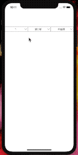

### ZCDropdownList



一：
```ruby
pod 'ZCDropdownList', '~> 0.1.1'
```

二：

```#import "ZCDropdownListView.h"```

三：
```

#define kScreenHeight [UIScreen mainScreen].bounds.size.height
#define kScreenWidth [UIScreen mainScreen].bounds.size.width
    
    ZCDropdownListItem *item1 = [[ZCDropdownListItem alloc] initWithItem:@"1" itemName:@"到手价"];
    ZCDropdownListItem *item2 = [[ZCDropdownListItem alloc] initWithItem:@"2" itemName:@"返利最高"];
    ZCDropdownListItem *item3 = [[ZCDropdownListItem alloc] initWithItem:@"3" itemName:@"返利最低"];
    NSArray *select1Array = @[item1,item2,item3];

    ZCDropdownListView *dropdownListView = [[ZCDropdownListView alloc] initWithDataSource:select1Array withType:2];
    dropdownListView.frame = CGRectMake(0, 200, kScreenWidth/3, 30);
    dropdownListView.selectedIndex = 0;
    //    dropdownListView.categoryName = @"分类";
    [dropdownListView setViewBorder:0.5 borderColor:[UIColor grayColor] cornerRadius:2];
    [self.view addSubview:dropdownListView];
    
    [dropdownListView setDropdownListViewSelectedBlock:^(ZCDropdownListView *dropdownListView) {
        NSString *msgString = [NSString stringWithFormat:
                               @"selected name:%@  id:%@"
                               , dropdownListView.selectedItem.itemName
                               , dropdownListView.selectedItem.itemId];
        
        NSLog(@"%@",msgString);
    }];
```


